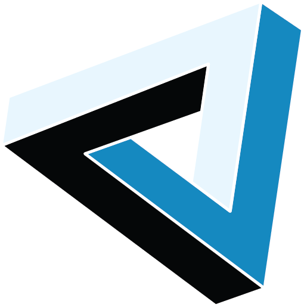

# DepthAI PoE WebApp | Bootstrap 4 & Vue.js SPA Dashboard 

> Based on dashmin (https://github.com/dacoto/dashmin-vue)

WebApp served by OAK PoE device to visualize various streams, metadata and AI results

## Project setup

Requirements:
 - Node, npm & yarn
 - Python3

```
yarn install
python3 -m pip install -r requirements.txt
```

### Builds and start the WebApp on DepthAI PoE device 

```
yarn start
```

### Flashes the WebApp to DepthAI PoE device 

```
yarn flash
```

### Compiles and hot-reloads for local development of WebApp

```
yarn serve
```

### Compiles and minifies WebApp to be able to be served by DepthAI

```
yarn build
```


### Lints and fixes WebApp files

```
yarn lint
```
